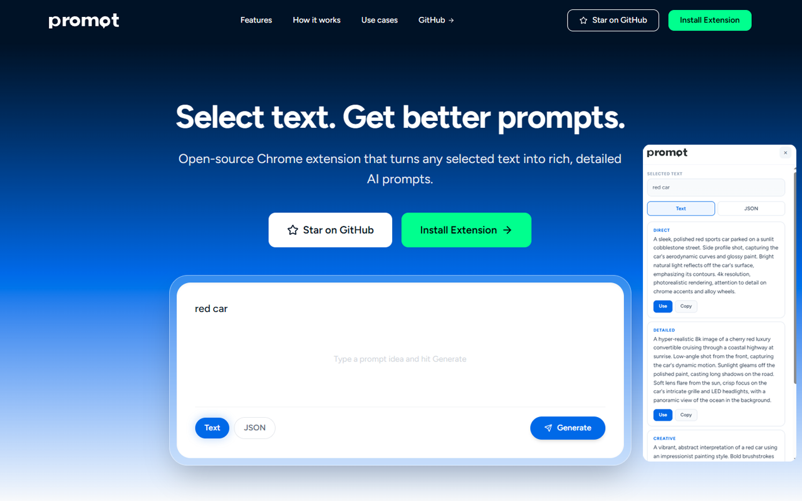

<div align="center">


**Metin sec. Daha iyi promptlar al.**

Sectiginiz herhangi bir metni zengin, detayli AI promptlarina donusturen acik kaynakli Chrome eklentisi.

[](LICENSE)
[](https://chromewebstore.google.com/detail/promqt/goiofojidgjbmgajafipjieninlfalnm)
[](https://github.com/umutcakirai/promqt)

**[English](README.md)** | **[Turkce](#)**



</div>

---

## Promqt nedir?

Herhangi bir web sitesinde metin secin, Promqt sizin icin 3 gelistirilmis prompt versiyonu uretsin: **Direct** (dogrudan), **Detailed** (detayli), **Creative** (yaratici).

ChatGPT, Claude, Gemini, Midjourney, DALL-E, Stable Diffusion ve diger tum AI araclariyla calisir.

## Nasil calisir?

1. Herhangi bir web sitesinde **metin secin**
2. **Promqt'u tetikleyin**:
   - Secimin ustunde beliren **✦ Promqt** butonuna tiklayin
   - **Ctrl+C** tusuna iki kez hizlica basin (DeepL gibi)
   - **Sag tiklayin** ve "Promqt" secenegini secin
3. Bir varyasyon secin, **Use** ile yapistin veya **Copy** ile kopyalayin

## Ozellikler

- **Text ve JSON cikti** - Dogal dil veya gorsel uretim araclari icin yapisal JSON
- **Kendi AI'ini kullan** - OpenAI, Claude, Gemini. Kendi API key'in, kendi modelin
- **3 varyasyon** - Direct, Detailed, Creative
- **Her yerde calisir** - Herhangi bir web sitesi, herhangi bir metin
- **Prompt gecmisi** - Tarayicinda yerel olarak kaydedilir
- **Suruklenebilir panel** - Sayfada istedigin yere tasi
- **Gizlilik oncelikli** - Veri toplama yok, takip yok, sunucu yok

## Kurulum

### Chrome Web Store (Onerilen)

**[Promqt'u Chrome Web Store'dan yukleyin](https://chromewebstore.google.com/detail/promqt/goiofojidgjbmgajafipjieninlfalnm)** — ucretsiz, tek tik, otomatik guncelleme.

### Manuel Kurulum (gelistiriciler icin)

<details>
<summary>Secenek 1: ZIP indir</summary>

1. **[promqt-latest.zip indir](https://github.com/umutcakirai/promqt/releases/latest/download/promqt-latest.zip)**
2. ZIP dosyasini bir klasore cikartin
3. Chrome → `chrome://extensions` acin
4. **Gelistirici modu** acin (sag ust)
5. **Paketlenmemis oge yukle** tiklayin ve cikarilan klasoru secin
6. Tamam!

</details>

<details>
<summary>Secenek 2: Git ile klonla</summary>

```bash
git clone https://github.com/umutcakirai/promqt.git
```
Ardindan `chrome://extensions`'da paketlenmemis oge olarak yukleyin.

</details>

### Kurulum sonrasi ayarlar

1. Chrome arac cubugundaki **Promqt ikonuna** tiklayin (veya yapboz ikonu > Promqt)
2. **Settings** sekmesine gidin
3. **Provider** secin (OpenAI, Google Gemini veya Anthropic Claude)
4. Acilan listeden bir **Model** secin:
   - OpenAI: GPT-4o, GPT-4.1 vb.
   - Gemini: Gemini 2.5 Flash vb.
   - Claude: Claude Sonnet 4 vb.
5. **API Key** yapistiriniz (saglayicinizdan alin):
   - OpenAI: [platform.openai.com/api-keys](https://platform.openai.com/api-keys)
   - Gemini: [aistudio.google.com/apikey](https://aistudio.google.com/apikey)
   - Claude: [console.anthropic.com/settings/keys](https://console.anthropic.com/settings/keys)
6. Key'inizin calistigini dogrulamak icin **Test Connection** tiklayin
7. **Save** tiklayin

Simdi herhangi bir web sayfasina gidin, bir metin secin ve deneyin!

## Desteklenen saglayicilar

| Saglayici | Modeller |
|-----------|----------|
| **OpenAI** | GPT-4o, GPT-4o Mini, GPT-4.1, GPT-4.1 Mini, GPT-4.1 Nano, o4 Mini |
| **Google Gemini** | Gemini 2.5 Flash, Gemini 2.0 Flash, Gemini 2.5 Pro |
| **Anthropic Claude** | Claude Sonnet 4, Claude Haiku 3.5 |

## Proje yapisi

```
promqt/
├── manifest.json     # Chrome eklenti manifestosu (MV3)
├── content.js        # Floating UI, metin secimi, Ctrl+C C
├── background.js     # API cagrilari, sag tik menusu, gecmis
├── providers.js      # OpenAI / Claude / Gemini API istemcisi
├── popup.html        # Ayarlar arayuzu
├── popup.js          # Ayarlar mantigi
├── icons/            # Eklenti ikonlari
├── LICENSE           # MIT
├── PRIVACY.md        # Gizlilik politikasi
└── CONTRIBUTING.md   # Katki rehberi
```

## Katki

1. Repo'yu fork'layin
2. Branch olusturun: `git checkout -b ozelligim`
3. Degisikliklerinizi yapin
4. Push edin ve Pull Request acin

Detaylar icin [CONTRIBUTING.md](CONTRIBUTING.md) dosyasina bakin.

### Katki fikirleri
- Daha fazla AI saglayici (Mistral, Cohere, Ollama/yerel modeller)
- Klavye kisayolu ozellestirme
- Ozel sistem promptlari / prompt sablonlari
- Firefox / Safari uyarlamasi
- Coklu dil destegi

## Gizlilik

API key'iniz tarayicinizda kalir. Secilen metin dogrudan AI saglayiciniza gider. Sunucu yok, analitik yok, takip yok.

Tam politika: [PRIVACY.md](PRIVACY.md)

## Lisans

[MIT](LICENSE)
